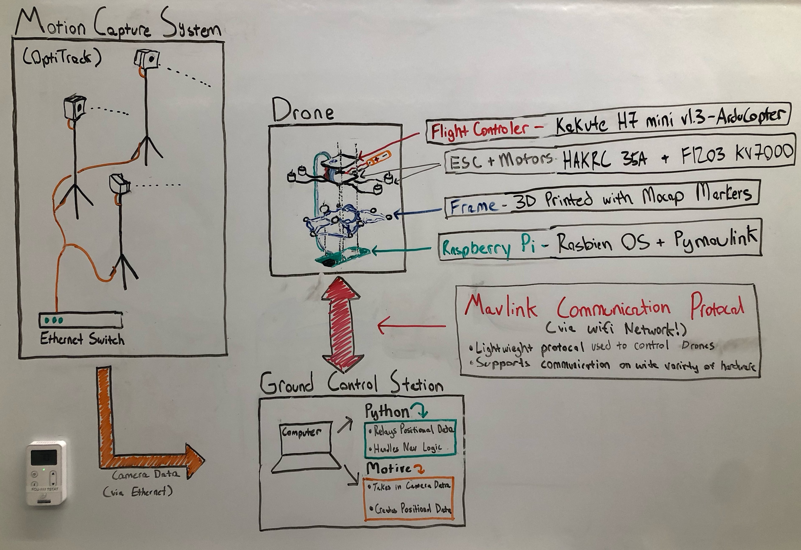
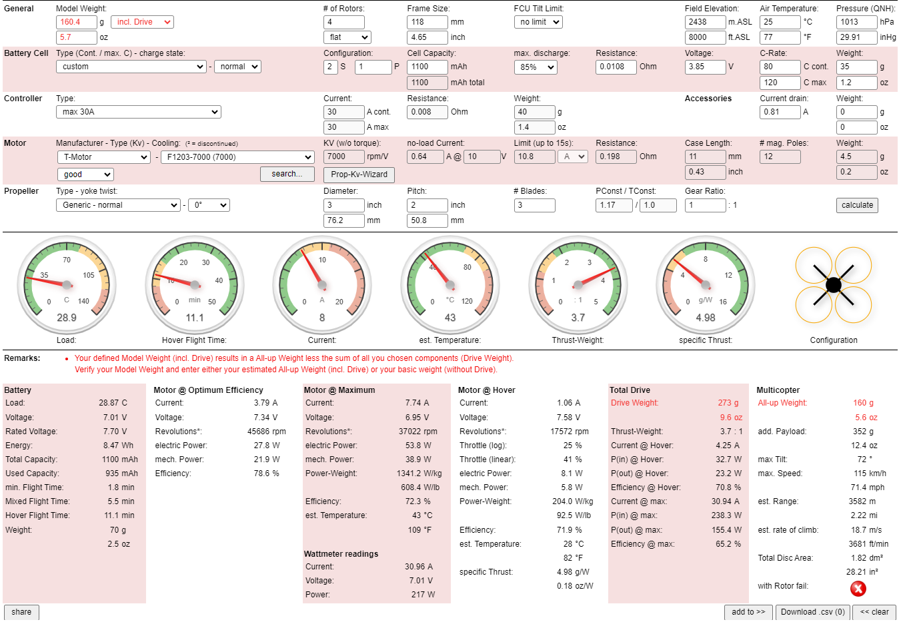
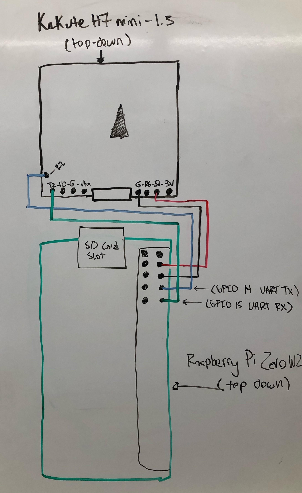
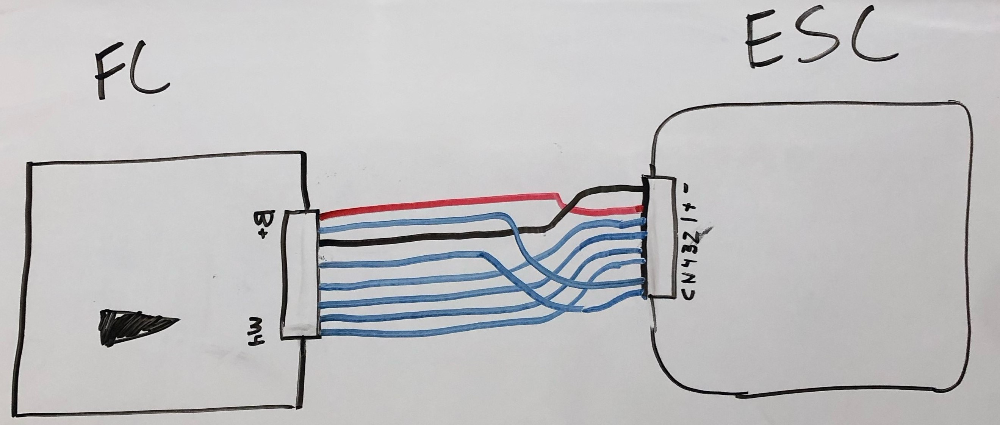
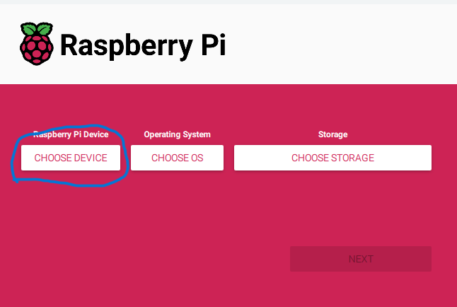

# Table of Contents

1. [System Overview](#1-system-overview)
2. [Basic Build and eCalc Statistics](#2-basic-build-and-ecalc-statistics)
3. [Physical Assembly](#3-physical-assembly)
   - [Flight Controller](#flight-controller)
   - [ESC](#electronic-speed-controller-esc)
   - [Raspberry Pi](#raspberry-pi)
4. [Firmware](#4-firmware)
   - [Flight Controller - ArduPilot/Kakute H7](#flight-controller---ardupilotkakute-h7)
   - [ESC](#electronic-speed-controller-esc-1)
   - [Raspberry Pi](#raspberry-pi-1)
5. [Initial Setup](#5-initial-setup)
   - [Raspberry Pi Antenna Setup](#raspberry-pi-antenna-setup)
   - [FC Config](#fc-config)

## 1. System Overview
This system was created to create a foundation for more advanced Computer Science and Mechanical Engineering projects.
Goals for this project were:

Presise Control - We have a very small indoor flight space so presicsion/safety was important

Controlled Environment - We wanted the system be simple, but also very accurate, in order for users to be confident there is very little noise or inconsitancey in the system.

Computer Based Control - Lastly wanted control of system to be encapsulated in easy to use code library, allowing begginner proggrammers to use the system without low level knowlegde of communication or flight control. 

Ultimately, with these contraints in mind, we decided to create a Motion Capture Drone system. 

This system is comprised of three main components:

Drone: Custom built, running ArduCopter firmware, with Raspberry Pi (Using Pymavlink library)

Ground Control Computer: Running Python (Using Pymavlink library) + Motive (Optitrack Software)

Motion Capture System: 6 Cameras connected to ethernet switch (Connected to Ground Control Computer)

This system leverages the existing functionality of ArduCopter Firmware, and Mavlink Communication Protocal. Meaning this system can be immediately be used with ArduCopter UAV's or could be easily adapted to work with any UAV that utilized Mavlink Communication. 

## 2. Basic Build and eCalc Statistics
First we need to build our drones! To confirm the performance of our proposed custom drone build, we use Ecalc Software. Ecalc takes in information about your custom drone, and predicts metrics such as Thrust:Weight and flight time

Basic Drone parts include, Frame, ESC, Motors, Props, and Batteries. Ecalc will also take into account the power draw of any drone components like Flight controller, FPV camera, and antenna. 
To begin we will make an Excel file with all of proposed parts, with summed weights, and power draws (not including motors)...

Note the totaled weights and power draw. Power draw does NOT include motors. 

Next step is to input this information into Ecalc ... 

Note we are using "Including Drive" as our weight option. This is because we have chosen all parts and know the actual weight. The other options beside "include drive" will asume your total weight doesn't include particular components and try to add those weights for you. In this case we can ignore the warning related to total weight, because the estimated weight that ecalc thinks this build should weigh is more than our actual parts. But since we went to the trouble of finding the actual total weight of our drone, we can ignore this. 

Take aways:

In order for our drone to be safely fly, Load, Current, Est. Temp, and Thrust-weight all have to be in the green. If these metrics are in yellow and red, drone my not be able to fly, or prone to damage itself. 

Flight time and Specific Thrust can be in Yellow or Red. Since we are going for an indoor drone with reasonably long flight time, our specific thrust is in the yellow. This is okay because specific thrust relates how effienctly our drone is turning wattage into thrust, and does not relate ablitly to drone to fly or possibly overheat. 

With this ecalc calculation we can confirm our drone will operate correctly with this combination of parts. 

## 3. Physical Assembly
### Flight Controller

For our flight controller we are using  Kakute h7 mini 1.3s. Compatible with Ardupilot Firmware. 

For wiring with PI, we are using Pi only as antenna, so we much make four connections, 5v, Ground, Tx (transmit pin), and Rx (recieve pin). 

For Wiring FPV Camera, our model has it's own antenna, so we only need 5v and GND

### Raspberry Pi
Additionally, we added a button to the raspberry pi in order to properly turn off pi (Pi must be turned off before battery is unplugged, otherwise pi does not shut down correctly). 

### Electronic Speed Controller (ESC)
Flight controller comes with 6 pin JST connector, but our ESC has a different pin mapping, so the connector has been repinned as such:

ESC motor connections in general do not matter, motor will be able to move no matter how the three pins are connected to ESC. The only difference it makes is the direction the motor spins, which you are able to switch in ESC firmware if desired. However for ease of use, we decided to use pin connectors between motor and esc for easy direction swapping...

In addition to motors, a XT30 connector is soldered onto power connections of ESC this connects direclty to 1100mah 2s High Voltage Lipo Battery. 

## 4. Firmware
### Flight Controller - ArduPilot/Kakute H7
For our flight controller, we decided to use ArduCopter firmware. Exact version is included in Firmware folder. 
Or you can download latest version here: https://firmware.ardupilot.org/Copter/
#### STM32Cube Programmer and ArduCopter ISO
Installation guide follows general ArduCopter installation available here: https://ardupilot.org/copter/docs/common-loading-firmware-onto-chibios-only-boards.html

In Short the steps are: 

1.Download arducopter_with_bl.hex (from repo, or latest from: https://firmware.ardupilot.org/Copter/), we want "with_bl" because your esc is using running BLHeli_s...

2.Download and Install STM32CUBEProgrammer software: https://www.st.com/en/development-tools/stm32cubeprog.html

3.While holding down Kakute H7 mini's DFU button, connect to PC via USB

4."USB Configuration" hit the refresh button, the port should change from "No DFU detected" to "USB#" # being any number. Hit connect.

Then device information should display at bottom of USB configuration window.

5.Now click the "open file" tab, and select the previously downloaded "arducopter_with_bl.hex"

6.Lastly, hit download...

After this arducopter will install on flight controller and you can disconnect when you are done...

### Electronic Speed Controller (ESC)
Our esc comes with blheli_s, meaning we will use BLHeliSuite to configure esc settings NOT BLheliSuite32. In our setup the only purpose of using BLHeliSuite is to reverse the direction of motors, without rewiring them. You may not need to use this configuration software you don't need to swap directions without rewiring...

#### BLHeliSuite
1.Download and Launch BLHeliSuite, available here: https://www.mediafire.com/folder/dx6kfaasyo24l/BLHeliSuite

2.Power Flight controller and Esc via battery (FC and ESC are connected via the modified 8-pin JST connector referened in hardware setup for FC). 

3.Once stack is powered by battery, plug flight controller into computer via USB.

4.In BLHeliSuite, click "Select ATMEL/SILABS Interface" drop down, and select "SILABS BLHeli Bootloader (cleanflight)" or the yellow "E". 

5.Now, in com window, select COM port that FC is currenlty connected under, Hit "connect", then hit "read setup"

Now you should be connected to ESC settings, and have the ability to modify ESC settings per motor. You can modify a single motor or muiltiple at same time by selecting motor numbers:

Then you can reversed motor direction for selected motors:

### Raspberry Pi
We are using Raspberry Pi Zero 2 W, so we need to flash a Pi OS on an SD card. You can follow official documentation here: https://www.raspberrypi.com/documentation/computers/getting-started.html

Or follow the simplified steps below. 
#### Raspbian Image Flasher

1.Download and Install Rasbien Pi Imager: https://www.raspberrypi.com/software/
2.Start application, and plug in SD Card that Pi OS will be flashed on.
3.Click "Choose Device"

4.Choose the Pi we are using, in this case Rasberry Pi Zero 2 W

   
5.For the OS, since we have now need for Desktop GUI, we are opting to use "PI OS Lite" (no desktop env). To do this hit "Choose OS"

6.Select "Other" options

7.Select "PI OS Lite (64 bit) 

## 5. Initial Setup
### Raspberry Pi Antenna Setup
#### Flight Controller Settings
#### Raspberry Pi Settings
#### MAVProxy Relay
### Flight Controller Configuration
#### Motor, Frame, Propeller, and Battery
#### Failsafes and Warnings
#### Calibration

